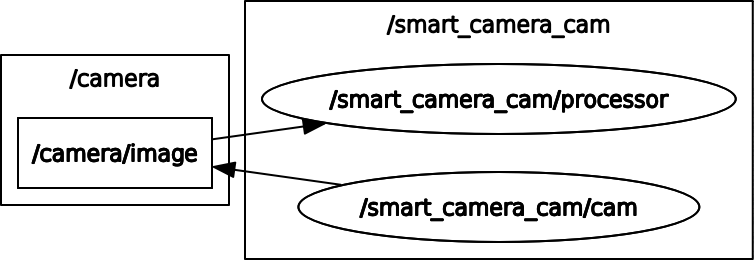
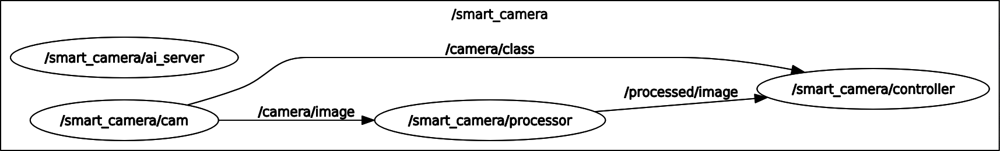
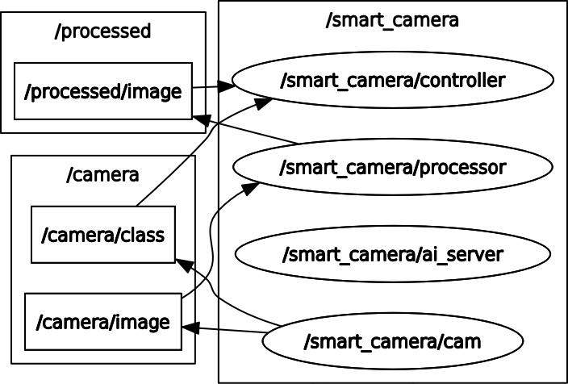

# Prüfungsvorleistung

## Structure

* [Description](#description)
* [Task 1](#task-1)
  * [ROS Introduction](#ROS-Introduction)
  * [ROS Basics](#ROS-Basics)
    * [Nodes](#Nodes)
    * [Topics](#Topics)
    * [Messages](#Messages)
  * [Task goal](#Task-1-goal)
* [Task 2](#Task-2)
  * [ROS Basics](#ROS-Basics-2)
    * [Message filters](#Message-filters)
    * [Time Synchronizer](#Time-Synchronizer)
  * [Task goal](#Task-2-goal)
    * [Creating a service](#Creating-a-service)
* Task 3


## Description

In this project we develop a ROS application capable of taking a single image or a video stream of images with handwritten digits, process it and predict the digit using a neuronal network. The project is divided in three tasks. Task 1 is responsible for setting the basic structure of the ROS application. In task 2 we develop the synchronization of the topics and the service for the neuronal network. Finally in task 3, we build and train the model used to predict the digits on the images using pytorch.

## Task 1

### ROS Introduction

ROS is an open-source, meta-operating system for robots. It provides the services from an operating system and also tools and libraries for obtaining, building, writing and running code across multiple computers.

### ROS Basics

#### Nodes

Nodes are one of the core building blocks of ROS. They are executables within a ROS package which can publish or subscribe to topics and can also provide or consume services.

#### Topics

Topics are channels in which messages are published. A node can publish or subscribe to a topic to send or receive messages.

#### Messages

Messages are sent through topics to nodes subscribed to certain topics. Messages can vary from primitive types such as  `int` to custom messages with custom fields and types.

#### Services

Services are another way that nodes can communicate with each other. Services allow nodes to send a request and receive a response. 

### Task 1 goal

In this task we set up the structure of the project.

1. Create a `cam` and a `processor` nodes.
2. We set up the `cam`node to publish 2 topics:
   * `/camera/image` which publishes an image with a handwritten digit
   * `/camera/class` which publishes the value of the digit with a custom message type
3. The `processor` node subscribes to the `/camera/image` and processes the image. The image is converted to a grayscale image and is cropped. Afterwards the processed image is published to the `/processed/image` topic.
4. We write a launch file to start both nodes with a single command

At the end of this task, our program structure looks like this:



## Task 2

### ROS Basics 2

#### Message filters

`message_filters` is a utility library that collects commonly used message "filtering" algorithms into a common space. The message filters work as follows: a message arrives into the filter and the filter decides whether a message is spit back out at a later point in time or not. An example of a message filter is the `Time Synchronizer`.

##### Time Synchronizer

The `TimeSynchronizer` filter synchronizes  incoming channels by the timestamps contained in their headers, and  outputs them in the form of a single callback that takes the same number of channels.

### Task 2 goal

In this task we use the message filter `TimeSynchronizer` to synchronize our 2 inputs from the controller node. We synchronize the class integer from the `/camera/class` topic and the processed image from the `/processed/image` topic.
The integer from the `/camera/class` topic uses a custom message defined as follow:

```python
# IntWithHeader.msg
Header header
int32 data
```

The `TimeSynchronizer` expects a message with a header containing the timestamp at which the message was sent. 

When the controller node receives this 2 inputs, this are saved as a python dictionary in an array like this:

```python
{ _class.data: _image }
```

The class being the integer and the image being a numpy array.

#### Creating a service

For us to be able to predict the handwritten digit in an image, a service is needed. We build a service that takes in an image and outputs an integer, this being the predicted class of the image.
Our service file looks like this:

```python
# Ai.srv
sensor_msgs/Image Image
---
int32 result
```

To use the service file we need a server script that handles the logic. For this task the server just takes the image and sends a hardcoded integer. Later in task 3 we will replace this with the actual neuronal network prediction.

At the end of this task our program structure looks like this:



