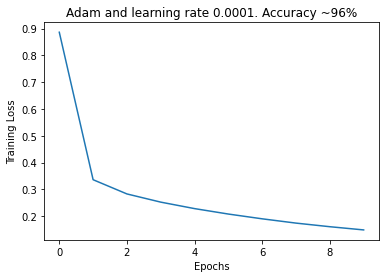

# Prüfungsvorleistung

## Structure

* [Description](#description)
* [Task 1](#task-1)
  * [ROS Introduction](#ROS-Introduction)
  * [ROS Basics](#ROS-Basics)
    * [Nodes](#Nodes)
    * [Topics](#Topics)
    * [Messages](#Messages)
  * [Task goal](#Task-1-goal)
* [Task 2](#Task-2)
  * [ROS Basics](#ROS-Basics-2)
    * [Message filters](#Message-filters)
    * [Time Synchronizer](#Time-Synchronizer)
  * [Task goal](#Task-2-goal)
    * [Creating a service](#Creating-a-service)
* [Task 3](#Task-3)
  * [Feedforward Neural networks](#Feedforward-Neural-Networks)
  * [Fully-connected Neural Networks](#Fully-connected-Neural-Networks)
  * [Forward pass](#Forward-pass)
  * [Softmax](#Softmax)
  * [Loss functions](#Loss-functions)
  * [Optimization](#Optimization)
  * [Backpropagation](#Backpropagation)
  * [Convolutional Neural Networks](#Convolutional-Neural-Networks)


## Description

In this project we develop a ROS application capable of taking a single image or a video stream of images with handwritten digits, process it and predict the digit using a neural network. The project is divided in three tasks. Task 1 is responsible for setting the basic structure of the ROS application. In task 2 we develop the synchronization of the topics and the service for the neural network. Finally in task 3, we build and train the model used to predict the digits on the images using pytorch.

## Task 1

### ROS Introduction

ROS is an open-source, meta-operating system for robots. It provides the services from an operating system and also tools and libraries for obtaining, building, writing and running code across multiple computers.

### ROS Basics

#### Nodes

Nodes are one of the core building blocks of ROS. They are executables within a ROS package which can publish or subscribe to topics and can also provide or consume services.

#### Topics

Topics are channels in which messages are published. A node can publish or subscribe to a topic to send or receive messages.

#### Messages

Messages are sent through topics to nodes subscribed to certain topics. Messages can vary from primitive types such as  `int` to custom messages with custom fields and types.

#### Services

Services are another way that nodes can communicate with each other. Services allow nodes to send a request and receive a response. 

### Task 1 goal

In this task we set up the structure of the project.

1. Create a `cam` and a `processor` nodes.
2. We set up the `cam`node to publish 2 topics:
   * `/camera/image` which publishes an image with a handwritten digit
   * `/camera/class` which publishes the value of the digit with a custom message type
3. The `processor` node subscribes to the `/camera/image` and processes the image. The image is converted to a grayscale image and is cropped. Afterwards the processed image is published to the `/processed/image` topic.
4. We write a launch file to start both nodes with a single command

At the end of this task, our program structure looks like this:


## Task 2

### ROS Basics 2

#### Message filters

`message_filters` is a utility library that collects commonly used message "filtering" algorithms into a common space. The message filters work as follows: a message arrives into the filter and the filter decides whether a message is spit back out at a later point in time or not. An example of a message filter is the `Time Synchronizer`.

##### Time Synchronizer

The `TimeSynchronizer` filter synchronizes  incoming channels by the timestamps contained in their headers, and  outputs them in the form of a single callback that takes the same number of channels.

### Task 2 goal

In this task we use the message filter `TimeSynchronizer` to synchronize our 2 inputs from the controller node. We synchronize the class integer from the `/camera/class` topic and the processed image from the `/processed/image` topic.
The integer from the `/camera/class` topic uses a custom message defined as follow:

```python
# IntWithHeader.msg
Header header
int32 data
```

The `TimeSynchronizer` expects a message with a header containing the timestamp at which the message was sent. 

When the controller node receives this 2 inputs, this are saved as a python dictionary in an array like this:

```python
{ _class.data: _image }
```

The class being the integer and the image being a numpy array.

#### Creating a service

For us to be able to predict the handwritten digit in an image, a service is needed. We build a service that takes in an image and outputs an integer, this being the predicted class of the image.
Our service file looks like this:

```python
# Ai.srv
sensor_msgs/Image Image
---
int32 result
```

To use the service file we need a server script that handles the logic. For this task the server just takes the image and sends a hardcoded integer. Later in task 3 we will replace this with the actual neural network prediction.

At the end of this task our program structure looks like this:


## Task 3

In this task we create a neural network which takes a handwritten digit image and outputs the digit as an integer. Moreover we modify the `ai_server` script to use the trained neural network and return the prediction to the controller node.

### Feedforward Neural Networks

The goal of a feedforward neural network is to approximate some function $f^*$. For example, for a classifier, $y = f^*(x)$ maps an input $x$ to a category $y$. A feedforward network defines a mapping $y = f(x;\theta)$ and learns the value of the parameters $\theta$ that result in the best function approximation.

This network is called feedforward because the information flows through the function being evaluated from $x$, through the intermediate computations used to define $f$, and finally to the output $y$.

Feedforward neural networks are called networks because they are typically represented by composing together many different functions. For example, we might have 3 functions $f^{(1)}$, $f^{(2)}$, $f^{(3)}$ connected in a chain, to form $ f(\textbf{x}) = f^{(3)}(f^{(2)}(f^{(1)}(\textbf{x}))) $. In this case, $f^{(1)}$ is the first layer, $f^{(2)}$ is the second layer, and so on. [[1](#Sources), 163-165]

Each layer is composed of neurons. Neurons take a set of inputs $x$, trainable parameters $\theta$ (or also called weights $w$) and a bias value $b$ and compute a result with the following function $\sum_{i} w_i x_i + b$. This result goes then through an activation function $f(\sum_{i} w_i x_i + b)$ and its the output of the neuron.

An activation function thresholds the output of the neuron within a numerical range. An example of an activation function is the ReLU activation function defined as $ f(x) = max(0, x) $. All negative values are converted to 0 and all positive values are unchanged.

### Fully-connected Neural Networks

In a fully-connected neural network, all the neurons from a layer are connected with all the neurons in the past and next layer. Neurons within the same layer are not connected with each other. This network architecture is the most used one.

### Forward pass

The forward pass of a neural network is computed with matrix multiplications. 

Imagine we have a 3 layer fully-connected neural network, the first layer has 128 neurons, the second layer has 64 and the output layer has 10 neurons which corresponds with our 10 digit classes (from 0 to 9).

In the case of our task we have $28 \times 28$ grayscale images. To feed them into a fully-connected neural network we need to convert these to a 1 dimensional vector of size $[784 \times 1]$. The first layer computes $[1 \times 784] * [784 \times 128] + b$. The second layer computes $[1 \times 128] * [128 \times 64] + b$. The output layer computes $[1 \times 64] * [64 \times 10]$. After each layer except the output layer, follows a ReLU activation function. The output of the network is a $[1 \times 10]$ vector containing a probability for each class. The sum of all probabilities is 1.

### Softmax

To get this probabilities in the output layer a function called softmax is a applied to the output values of the last layer. Softmax is defined as $ \sigma(y) = \frac{e^{f_{y_i}}}{\sum_j e_{f_{j_i}}}$, where $f_{y_i}$ is the predicted class and $\sum_j e_{f_{j_i}}$ is the sum of the output of all the classes. This function squashes all the values to a probability distribution. The class with the highest probability is the predicted class.

### Loss functions

A loss function measures how wrong the prediction of our network is. Typically the lower the loss value is, the better is the network prediction. A loss function for classification problems is the cross-entropy loss or log loss. This loss measures the performance of a classification model whose output is a probability value between 0 and 1. Cross-entropy loss increases as the predicted probability diverges from the actual label. So predicting a probability of .012 when the actual observation label is 1 would be bad and result in a high loss value. A perfect model would have a log loss of 0. [[2](#Sources)]

### Optimization

The goal of a neural network is to minimize the loss and therefore find the best combination of parameters. One could manually adjust the parameters until a perfect set is found but this would take a lot of time. Instead we can use the partial derivative of the loss function which gives us a gradient. This gradient points in the direction of steepest ascent, if we take the negative of the gradient we can update the parameters by this gradient and through an iterative process arrive at the bottom of the function which corresponds to the best set of parameters. For this task I used the Adam optimizer.

### Backpropagation

To calculate the partial derivative of very complex functions there is an algorithm called backpropagation. This algorithm uses the chain rule of derivatives to compute gradients at a local level.

### Convolutional Neural Networks

Convolutional neural networks (CNN) are a special kind of neural networks which work extremely well with images. In this kind of neural networks the image is not converted to a vector and is left at its original dimensions, in our case $28 \times 28$. The neurons of the layers of this network are arranged in filters of typically size $3 \times 3$ or $5 \times 5$ stacked on each other. This filters are slided (or convolved) over the image with a fixed step size called stride and computes matrix multiplications at each position. The output of a layer is a feature map which is fed into the next layer. The size of this feature map depends on the size of the filter, the stride and the padding.

Convolutional neural networks maintain the spatial dimensions, thus they maintain the location of the objects on the images.

### Training the neural network for MNIST

 For the implementation of the neural network, the framework pytorch was used.

Firstly I imported the MNIST dataset from `torchvision.datasets` and converted the images to a vector with a [Transform](https://pytorch.org/docs/stable/torchvision/transforms.html?highlight=transform). This creates a train and a test split of the dataset. Secondly I created a [Dataloader](https://pytorch.org/docs/stable/data.html#torch.utils.data.DataLoader) for each split and specified a batch size of 64.

Once the dataset was ready I defined the model. The model is composed of 2 hidden layers and one output layer. The first layer has 128 neurons and the second 64 neurons. Both hidden layers are followed by a ReLU activation function. The output layer has 10 classes corresponding to the digits from 0 to 9, after this layer the values are converted to a probability distribution with softmax.

Afterwards I defined the training loop. The model was trained with a cross-entropy loss and the adam optimizer with a learning rate of 0.01 for 10 epochs. After the 10 epochs the model with the lowest loss was saved on a file named `weights.pt`.

This file was imported in the ROS application for the prediction.

The accuracy of this model is ~97%.

### Training a convolutional neural network

In addition to the fully-connected network, I trained a convolutional neural network to compare the results. The CNN is composed of a single convolutional layer with 32 filters of size $3 \times 3$, stride 1 and padding 1. The convolutional layer was followed by a pooling layer of size $2 \times 2$, to reduce the dimensions of the image by a factor of 2, and 3 fully-connected layers with 120, 84 and 10 neurons. The convolutional layer and both first fully-connected layers are followed by a ReLU activation function. The model was also trained with a cross-entropy loss and the adam optimizer with a learning rate of 0.01 for 10 epochs.

The accuracy of this model is ~98%.

### Modifying the ROS application

For the application to work with the trained model we have to modify some components. Firstly we need to load an actual MNIST image in the camera node. For this I used `cv2.imread` and created a helper function to read the image. With the help of the `random`package I generate a random number from 0 to 9, load the corresponding image and publish it on the `/camera/image` topic. The random generated number is also published on the `/camera/class` topic.

The processor node listening on the `/camera/image` topic receives an image and with the help of the method `imgmsg_to_cv2(image, 'mono8')` from `CvBridge`, converts the RGB image to a grayscale image. The converted image is then published on the `/processed/image` topic.

Afterwards we have to modify the `ai_server` to be able to work with pytorch. After importing all the packages we need to normalize the image, this means to bring all the pixel values to a number between 0 and 1. Also we have to convert the integer values to floats.

Subsequently we need to define a function to generate the model:

```python
def generate_model():
  return nn.Sequential(
    nn.Linear(784, 128),
    nn.ReLU(),
    nn.Linear(128, 64),
    nn.ReLU(),
    nn.Linear(64, 10),
    nn.LogSoftmax(dim=1)
  )
```

In addition to generating the model we need a function to load and transform the image for pytorch.

```python
def load_image(img):
  loader = transforms.Compose([transforms.ToTensor()])
  return loader(img).float()
```

After this we create a function to make the actual prediction with the trained model. This function takes an image, loads the trained model and evaluates the image. The output is the integer class value of the image.

The controller node receives the processed image from `/processed/image` and the ground truth class from `/camera/class`. With this it sends a request to the `ai_server`node which responds with the prediction class. The controller node then outputs both, the ground truth and prediction to the console.

## Experimenting with the neural network training

### Linear model

Different optimizers:

<div style="display: flex; justify-content: center;">
    
    
</div>

Different optimizers and learning rates:

<div style="display: flex; justify-content: center;">
    
    
</div>

### Convolutional model

<div style="display: flex; justify-content: center;">
    
    
</div>

<div style="display: flex; justify-content: center;">
    
    
</div>

## Sources

1. Ian Goodfellow, Yoshua Bengio und Aaron Courville. Deep Learning. http://www.deeplearningbook.org. MIT Press, 2016. Visited 05.09.2020
2. ML Glossary, Loss functions. [https://ml-cheatsheet.readthedocs.io/en/latest/loss_functions.html#:~:text=Cross%2Dentropy%20loss%2C%20or%20log,diverges%20from%20the%20actual%20label.&text=As%20the%20predicted%20probability%20decreases,the%20log%20loss%20increases%20rapidly.](https://ml-cheatsheet.readthedocs.io/en/latest/loss_functions.html#:~:text=Cross-entropy loss%2C or log,diverges from the actual label.&text=As the predicted probability decreases,the log loss increases rapidly.). Visited 05.09.2020.

